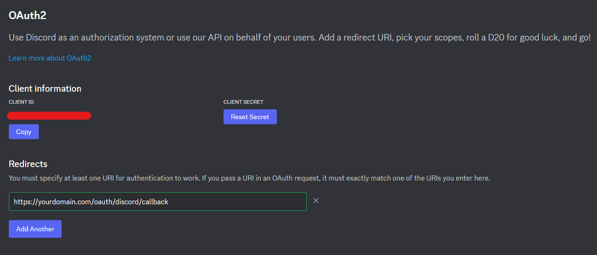
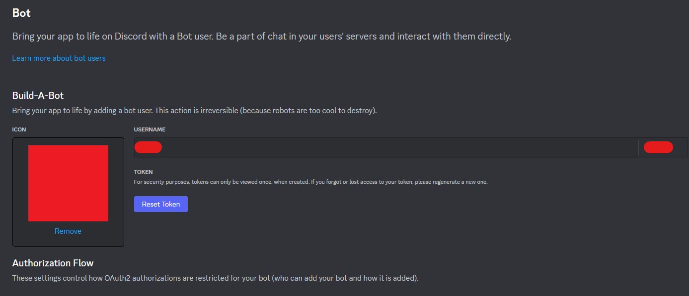

First, you need to [create a developer application](https://discord.com/developers/applications) on the Discord website. If you have already created this application to use the rich presence of vmsACARS, you can use the same one.

Next, go to OAuth2 > General. Copy the client ID and client secret to be used in the configuration later. Additionally, you need to add a redirect; the URL to add is `https://yourdomain.com/oauth/discord/callback`.



In the `.env` file, add the following:

```shell title=".env"
DISCORD_OAUTH_ENABLED=true
DISCORD_CLIENT_ID={your_client_id_copied_before}
DISCORD_CLIENT_SECRET={your_client_secret_copied_before}
```

Now, your users can link their Discord account to their phpVMS account and use their Discord account to log in. The link between the two accounts is automatically established when clicking the "Login with Discord" button on the login page. However, if the email address of the Discord account is different from the email address of the phpVMS account, it must be done manually on the profile page.

## Sending Private Messages

If you want to send private message notifications to your users (development still in progress), you need to create a Discord bot in the bot section of your Discord application and copy the token. <br/>
If this option is not enabled, the `discord_private_channel_id` field will not be filled. This field contains a unique discussion ID between the bot and the user, so it is imperative to have a bot to fill it.



Place the token in the `.env`:

```shell title=".env"
DISCORD_BOT_TOKEN={your_bot_token_copied_before}
```

## Customizing scopes

You can add scopes to the OAuth request in addition to the default scopes by adding your scopes to the `.env` file, separated by commas.
See [Discord Scopes List](https://discord.com/developers/docs/topics/oauth2)

```shell title=".env"
DISCORD_SCOPES=scope1,scope2
```
